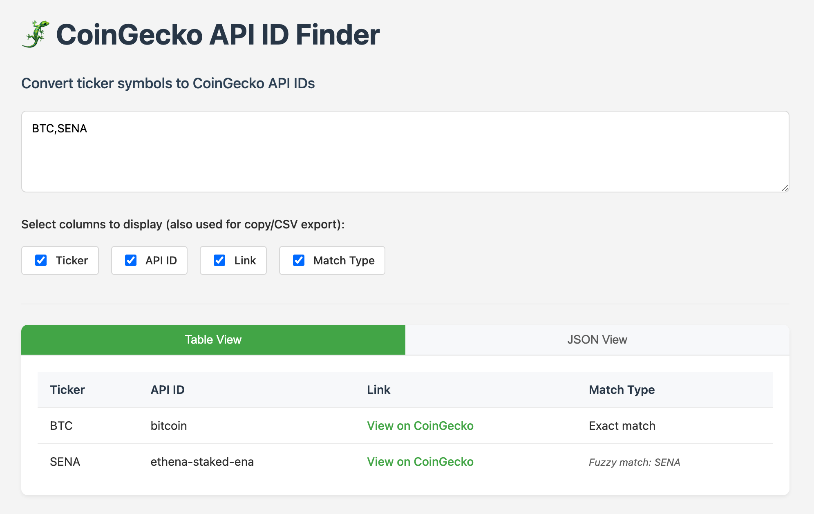

# CoinGecko ID Finder

A static web application that helps you find CoinGecko IDs for cryptocurrency tickers. Built out of the frustration with CoinGecko's unintuitive ID system, this tool finds CoinGecko IDs based on just a ticker symbol. Results are initially filtered by market capitalization, with some fuzzy match proccessing after.

Live @ https://erik-gunnarsson.github.io/ticker-to-coingecko-api-id/

## Contributing

Contributions are welcome! Please feel free to submit a Pull Request.

## License

This project is licensed under the MIT License - see the LICENSE file for details.

## Disclaimer

This tool is not affiliated with CoinGecko. It was built to help those working with the CoinGecko API.
