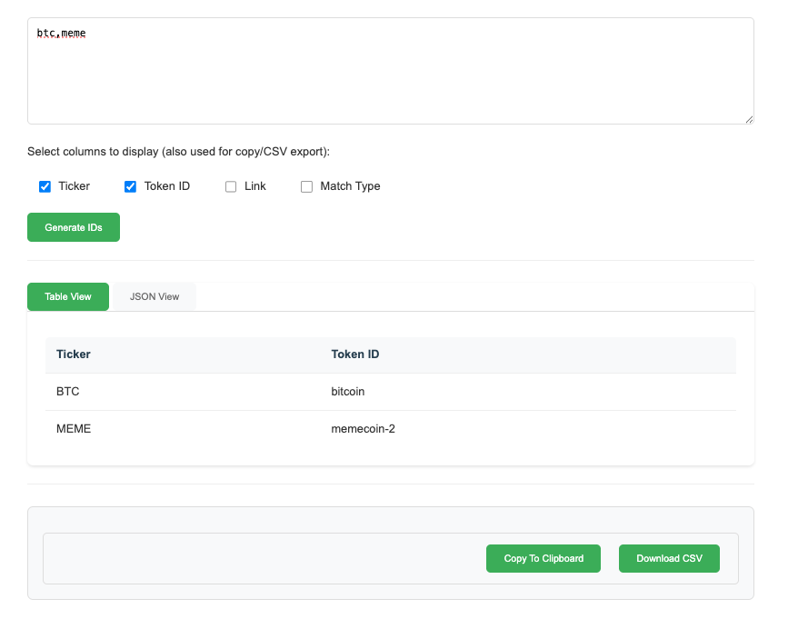

# CoinGecko ID Finder

A static web application that helps you find CoinGecko IDs for cryptocurrency tickers. Built out of the frustration with CoinGecko's unintuitive ID system, this tool finds CoinGecko IDs based on just a ticker symbol. Results are initially filtered by market capitalization, with additional granular sorting options available.

🌐 **Live Demo:** [https://yourusername.github.io/CoinGecko_ID_Finder/](https://yourusername.github.io/CoinGecko_ID_Finder/)

## Screenshot


## Features

- 🔍 Find CoinGecko IDs using ticker symbols (e.g., BTC, ETH, USDT)
- 📊 Results filtered by market capitalization
- 🔄 Fuzzy matching for similar tickers
- 📱 Clean, modern web interface
- 📋 View results in table or JSON format
- 📥 Export results to CSV or copy to clipboard
- ⚡ Fast client-side search (no server required)
- 🔄 Automatically updated cryptocurrency data

## How It Works

This is a static website that can be hosted on GitHub Pages. All searching is done client-side using pre-generated cryptocurrency data.

### Key Components:
- `index.html` - The main HTML page
- `app.js` - JavaScript for search functionality and UI interactions
- `style.css` - Styling for the application
- `crypto_data.json` - Pre-generated cryptocurrency data (updated daily via GitHub Actions)

## Setting Up Your Own Instance

1. Fork this repository

2. Enable GitHub Pages:
   - Go to Settings → Pages
   - Select "Deploy from a branch"
   - Choose "main" branch and "/ (root)" folder
   - Click Save

3. Update the crypto data:
   ```bash
   python generate_crypto_data.py
   ```

4. Your site will be available at: `https://[your-username].github.io/CoinGecko_ID_Finder/`

## Updating Cryptocurrency Data

### Manual Update
To manually update the cryptocurrency data:

```bash
# Install dependencies
pip install -r requirements.txt

# Generate new data
python generate_crypto_data.py
```

### Automatic Updates (GitHub Actions)
The repository includes a GitHub Actions workflow that automatically updates the cryptocurrency data daily. To enable it:

1. Go to Settings → Actions → General
2. Under "Workflow permissions", select "Read and write permissions"
3. The data will be updated automatically every day at midnight UTC

## Local Development

To run the site locally:

1. Clone the repository:
   ```bash
   git clone https://github.com/yourusername/CoinGecko_ID_Finder.git
   cd CoinGecko_ID_Finder
   ```

2. Serve the files locally:
   ```bash
   # Using Python
   python -m http.server 8000
   
   # Or using Node.js
   npx serve
   ```

3. Open your browser to `http://localhost:8000`

## API Usage and Rate Limits

The `generate_crypto_data.py` script fetches data from CoinGecko's public API. Please be mindful of their rate limits:
- The script includes delays between requests to avoid hitting rate limits
- If you encounter rate limit errors, wait a few minutes before trying again

## Project Structure

```
CoinGecko_ID_Finder/
├── index.html              # Main HTML page
├── app.js                  # JavaScript search logic
├── style.css              # Styling
├── crypto_data.json       # Pre-generated cryptocurrency data
├── generate_crypto_data.py # Script to update crypto data
├── common_mapping.py      # Common ticker mappings
├── requirements.txt       # Python dependencies
├── .github/
│   └── workflows/
│       └── update-data.yml # GitHub Actions workflow
└── README.md
```

## Contributing

Contributions are welcome! Please feel free to submit a Pull Request.

## License

This project is licensed under the MIT License - see the LICENSE file for details.

## Disclaimer

This tool is not affiliated with CoinGecko. It was built to help developers and users find CoinGecko IDs more easily.
